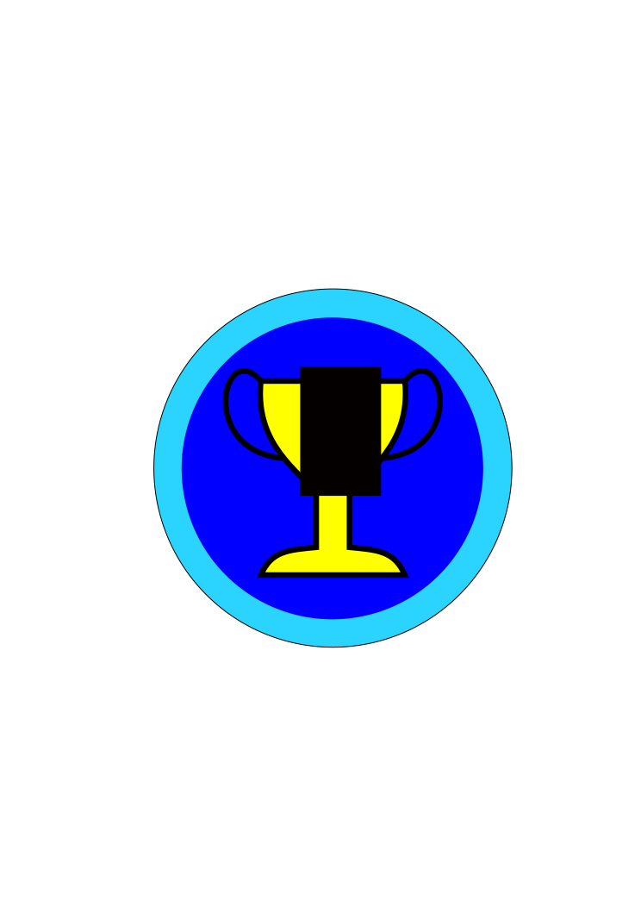

# Сдал все экзамены

# Сдал всю практику

# Первым сдал все экзамены

# Вторым сдал все экзамены

# Третьим сдал все экзамены

# Первым сдал всю практику

# Вторым сдал всю практику

# Третьим сдал всю практику

