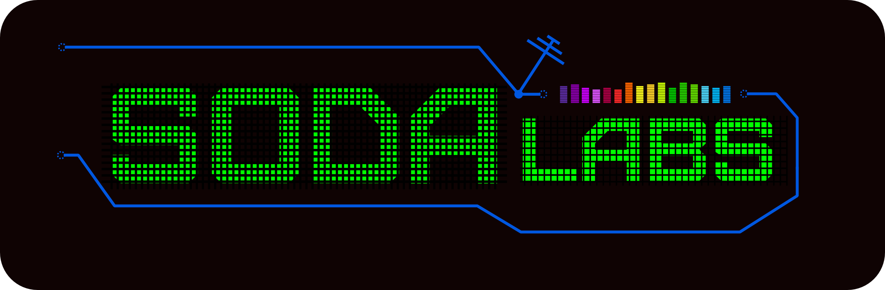

 

 Hacks & Tips
===

#### Репозиторий для хаков, подсказок, ответов на вопросы

===============

### == ПРАВИЛА == [>>](DOCS/RULES)

 - [Кодекс поведения](DOCS/RULES/CULTURE.md)
 - [Начисления кармы](DOCS/RULES/KARMA.md)
 - [Написания кода](DOCS/RULES/CODING.md)
 - [`commit`/`issue`/`pull-request`](DOCS/RULES/COMMITS.md)
 - [Оформления репо](DOCS/RULES/REPOS.md)

//
- [Родители](DOCS/RULES/PARENTS.md)
- [Учителя](DOCS/RULES/TEACHERS.md)
- [Менторы](DOCS/RULES/MENTORS.md)

***

### == ЭКЗАМЕНЫ == [>>](TEST)

 - [Вопросы](EXAMS/QUESTIONS)
 - [Ответы](EXAMS/ANSWERS)
 - [Хвосты](EXAMS/arrears.md)
 - [Предстоящие](EXAMS/coming.md)

***

### == ДОСТИЖЕНИЯ == [>>](up)
 - [Карма](karma.md)
 - [Награды](awards.md)

***

### == ШПАРГАЛКИ == [>>](CHEATSHEETS)

 - [Markdown](CHEATSHEETS/draft/Markdown.md)
 - [Emacs](CHEATSHEETS/draft/Emacs.md)
 - [Emacs:настройка](CHEATSHEETS/emacs-setup.md)
 - [Git](CHEATSHEETS/Git.Hub.md)
 - [GitHub](CHEATSHEETS/draft/GitHub.md)
 - [Ubuntu](CHEATSHEETS/draft/Ubuntu.md)
 - [Bash:commands](CHEATSHEETS/draft/bash:commands.md)
 - [Query-language](CHEATSHEETS/Query-language.md)
 - [Foursquare](EXAMS/ANSWERS/foursquare.md)
***

### == WISHLIST == [>>](WISHLIST)

 - `люди`
 - `события`
 - `оборудование`
 - `...`

# Есть свежие Идеи, стремные Проблемы и смелые Решения? 
### Ок. Не стесняемся! дополняем / улучшаем / размещаем в [`issues`](https://github.com/soda-io/Hacks-and-Tips/issues/new)
